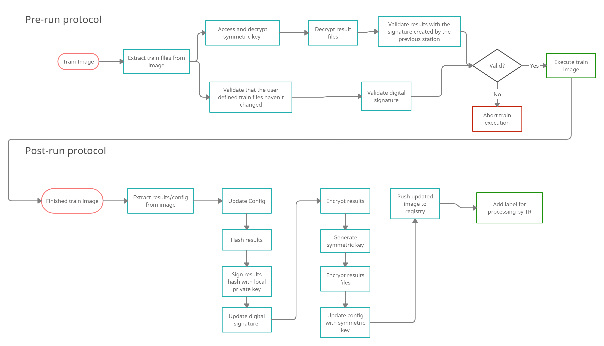

Security
============
This module is responsible for securing the transfer of result files contained in the docker images that represent
PHT Trains. This is done by encrypting the resulting files using envelope encryption.

Additionally the progression of the train, the validity of the image and the results, as well as the identities of the
participating stations are validated before a participant executes a train image.
    TODO add link to paper

A more detailed description of the steps involved in the Protocol refer [link to paper].

The different stages of this protocol are used in the main DAG used by the pht station [link to station docu, repo]
but can also be used independently i.e. to to offer decryption of result to authorized users at a station.

    TODO add images showing how the security protocol works

The classes and functions implementing the security protocol are documented in the following sections.

Security Protocol
-----------------
The following image shows the steps performed by the protocol, the pre-run protocol is performed before a train is executed
and after decrypting the files checks the validity of the immutable files, if the hash of the result files corresponds to the hash sent by the
previous station and the validity of the digital signature.

After a successful execution of the train container the post-run protocol calculates the hash of the  results, signs the
hash and the digital signature, encrypts the files using a new symmetric key. This key is encrypted using the public keys
provided in the train configuration .json file and stored in the image. Before it is transferred to other stations.

.. autoclass:: train_lib.security.SecurityProtocol.SecurityProtocol
    :members:
    :undoc-members:
    :show-inheritance:

Key Manager
-----------

.. autoclass:: train_lib.security.KeyManager.KeyManager
    :members:
    :undoc-members:
    :show-inheritance:

Hashing
-------

.. automodule:: train_lib.security.Hashing
    :members:
    :undoc-members:
    :show-inheritance:

Symmetric Encryption
--------------------

.. autoclass:: train_lib.security.SymmetricEncryption.FileEncryptor
    :members:
    :undoc-members:
    :show-inheritance:

Docker Image Validation
-----------------------

.. automodule:: train_lib.docker_util.validate_master_image
    :members:
    :undoc-members:
    :show-inheritance:

